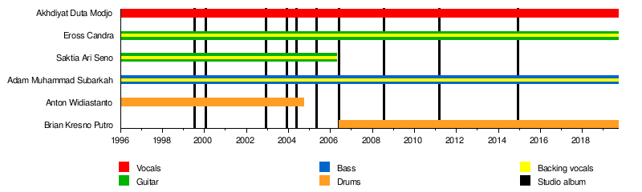

```{r setup, include=FALSE}
knitr::opts_chunk$set(echo = TRUE, warning = FALSE, message = FALSE, fig.align = "center")
```

```{r package}
library(tidyverse)
library(corrplot)
```

```{r plot_theme}
plot_theme <- theme(legend.position = 'top', 
                    panel.background = element_rect(fill = 'white'), 
                    panel.grid.major = element_line(colour = 'grey'),
                    panel.grid.minor = element_line(colour = 'grey',
                                                    linetype = 3), 
                    panel.border = element_rect(colour = 'black', 
                                                fill = NA), 
                    plot.title = element_text(hjust = 0.5))
```


## Top Streamed Local Artist 2018

Load data dari folder `data`. 

```{r load_data}
load("../data/top_streamed_indonesia.rda")
head(top_streamed_indonesia)
names(top_streamed_indonesia)
top_streamed_indonesia <- top_streamed_indonesia %>%
  distinct()
dim(top_streamed_indonesia)
top_streamed_indonesia$playcount <- as.numeric(top_streamed_indonesia$playcount)
```

```{r}
sheila <- top_streamed_indonesia %>%
  filter(artist == "Sheila On 7") %>%
  select(-c("disc", "uri", "id")) # drop variable yang tidak diperlukan
head(sheila)
```

## Sheila On 7

### Analisis Playcount

Sheila On 7 merupakan band lokal yang paling banyak di stream pada tahun 2018 menurut Spotify. Lagu apa yang sering di stream? Ternyata lagu yang paling banyak di stream adalah lagu **Dan...**. Ternyata masih banyak pengguna spotify yang menyukai lagu lagu lawas. Selain Sheila On 7, Payung Teduh menjadi artist yang paling banyak di stream dengan lagunya yang dimainkan di setiap resepsi pernikahan.

```{r}
top_streamed_indonesia %>%
  select(artist, name.y, playcount) %>%
  rename(Artist = artist, "Judul Lagu" = name.y, Playcount = playcount) %>%
  arrange(-Playcount) %>%
  top_n(10)
```

Dari lagu-lagu Sheila On 7, apa lagu 10 besar yang paling banyak di stream? Tentu saja **Dan...** nomor satu. Lebih jauh lagi, lagu dari album mana saja yang di stream? 

```{r}
sheila %>%
  top_n(10, playcount) %>%
  ggplot(aes(x = reorder(name.y, playcount), y = playcount, 
             fill = album)) +
  geom_col() +
  coord_flip() +
  plot_theme +
  scale_fill_discrete(name = "Judul Album", 
                      guide = guide_legend(nrow = 4)) + # membuat legend row menjadi 4
  labs(x = "Judul Lagu", 
       y = "Playcount per lagu")
```

Jika diurutkan menurut jumlah `playcount`, pada 10 lagu terbanyak di stream, album Sheila On 7 yang pertama (1999) sangat populer dengan lagu **Dan...** dan **Anugerah Terindah Yang Pernah Kumiliki**. Sedangkan, album OST 30 Hari mencari Cinta (2003) menjadi penyumbang lagu terbanyak dengan 3 lagu. Jadi, lagu-lagu Sheila On 7 yang laku itu justru pada masa awal-awal 

```{r}
sheila %>%
  group_by(album) %>%
  summarise(avg_play = mean(playcount, na.rm = TRUE)) %>%
  ggplot(aes(x = reorder(album, avg_play), y = avg_play)) +
  geom_col() +
  coord_flip() +
  plot_theme +
  labs(x = "Judul Album", 
       y = "Rata-rata Playcount per lagu")
```

```{r, out.width="100%"}

```


```{r}
top_streamed_indonesia %>%
  select_if(is.numeric) %>%
  filter(is.na(playcount) != TRUE) %>%
  cor() %>%
  corrplot(method = "color", order = "hclust", type = "upper", 
           addCoef.col = "black", tl.col = "black", 
           tl.srt = 45, diag = FALSE, tl.cex = 0.8, number.cex = 0.6)
```

